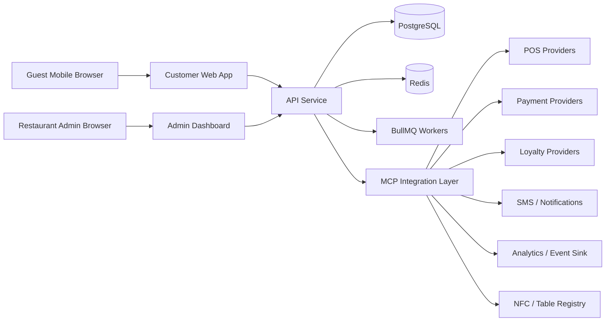
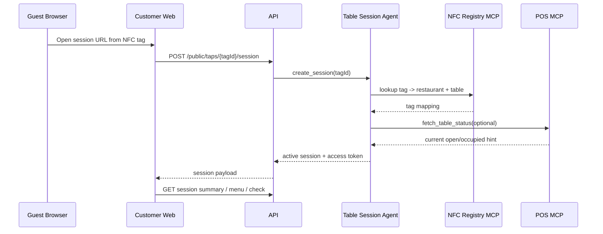
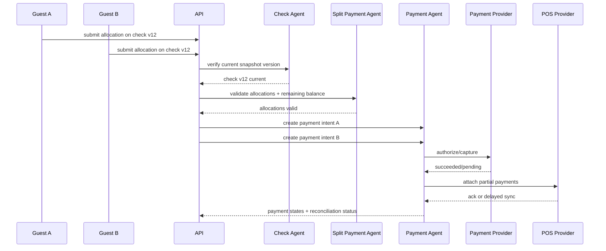

# Taps Architecture

## Stack Choice

### Proposed stack

- Frontend: Next.js App Router with React and TypeScript
- Backend API: Fastify with TypeScript
- Database: PostgreSQL
- Cache and coordination: Redis
- Queue/job runner: BullMQ
- ORM/schema: Drizzle ORM + SQL migrations
- Payments: Stripe-compatible abstraction
- POS integration: adapter-based MCP provider layer
- Observability: OpenTelemetry, structured JSON logging, metrics export
- Monorepo: `pnpm` workspaces + Turborepo

### Why this stack

- TypeScript end to end keeps domain contracts consistent across guest app, admin app, API, and adapters.
- Fastify is pragmatic, fast, and clean for route-driven API and webhook handling.
- PostgreSQL supports transactional correctness, JSON payload retention, audit tables, and reconciliation queries.
- Redis gives us idempotency coordination, distributed locks, and BullMQ-backed job queues when running beyond the in-memory demo worker path.
- Drizzle keeps schema explicit and migration-friendly without hiding SQL details.
- Next.js is practical for NFC landing performance, SEO-lite public screens, and admin/dashboard routing.

## Top-Level System

## Current Scaffold Mode

The current implementation includes:

- Postgres-backed repositories for sessions, checks, allocations, payment attempts, loyalty profiles, exceptions, and audit records
- guest and admin Next.js frontends wired to the real backend route contracts
- a memory queue for local/demo job processing plus BullMQ-ready enqueue and worker startup seams
- a memory POS adapter and mock payment provider for the cleanest local demo path
- Stripe and Square sandbox-prep adapters with webhook signature verification and typed event mapping

This keeps the architecture provider-driven while being explicit about what is demo-ready today versus what still depends on live merchant sandbox validation.

## Agent / Skill / Subagent Model

The system uses agent language as a service decomposition model, not as fake AI.

### 1. Table Session Agent

Responsibilities:

- map NFC tags to restaurants and tables
- create and rotate dining sessions
- manage public access expiry and audit retention
- handle close, transfer, reopen, and archive workflows

Skills:

- `create_session`
- `attach_table`
- `expire_session`
- `lock_closed_session`
- `remap_transferred_table`
- `archive_session`
- `validate_public_access`

Subagents:

- `session_expiry_worker`
- `table_transfer_handler`
- `stale_session_detector`

### 2. Menu Agent

Responsibilities:

- fetch and normalize menus
- attach modifiers and availability
- maintain mirrored menu snapshots

Skills:

- `fetch_menu`
- `normalize_menu`
- `attach_modifiers`
- `apply_availability`
- `validate_price_snapshot`

Subagents:

- `menu_sync_worker`
- `modifier_normalizer`
- `catalog_diff_checker`

### 3. Order / Check Agent

Responsibilities:

- retrieve or create open checks
- maintain normalized check snapshots
- detect check changes and void/cancel state

Skills:

- `fetch_open_check`
- `create_check`
- `refresh_check_snapshot`
- `detect_check_changes`
- `apply_void_or_cancel_update`
- `map_pos_order_to_internal_model`

Subagents:

- `check_snapshot_builder`
- `change_detector`
- `check_version_guard`

### 4. Split Payment Agent

Responsibilities:

- compute and validate allocations
- prevent orphaned items
- enforce close rules

Skills:

- `split_evenly`
- `assign_items_to_payer`
- `fractionally_allocate_item`
- `custom_allocate_amount`
- `resolve_shared_items`
- `compute_remaining_balance`
- `validate_no_orphan_items`
- `enforce_close_rules`

Subagents:

- `allocation_engine`
- `rounding_engine`
- `orphan_item_guard`
- `concurrency_guard`

### 5. Payment Agent

Responsibilities:

- create payment intents
- authorize and capture
- attach payment records to checks
- reconcile internal/provider/POS state

Skills:

- `create_payment_intent`
- `authorize_payment`
- `capture_payment`
- `attach_payment_to_check`
- `handle_partial_payment`
- `handle_tip`
- `mark_payment_failed`
- `reconcile_payment_state`

Subagents:

- `payment_retry_worker`
- `payment_reconciliation_worker`
- `failed_payment_handler`

### 6. POS Integration Agent

Responsibilities:

- abstract restaurant POS systems
- treat POS as source of truth
- support provider-specific semantics through adapters

Skills:

- `fetch_menu_from_pos`
- `fetch_check_from_pos`
- `create_order_in_pos`
- `attach_payment_in_pos`
- `fetch_table_status`
- `detect_closed_check`
- `sync_voids_and_cancels`

Subagents:

- `square_adapter`
- `toast_adapter_placeholder`
- `webhook_handler`
- `poll_reconciler`

### 7. Loyalty Agent

Responsibilities:

- normalize phone identity
- attach customer identity to session
- award and redeem rewards

Skills:

- `lookup_customer_by_phone`
- `create_customer_profile`
- `attach_loyalty_to_session`
- `award_points`
- `calculate_reward_eligibility`
- `expire_or_redeem_rewards`

Subagents:

- `phone_identity_normalizer`
- `points_ledger_worker`
- `reward_eligibility_checker`

### 8. Admin / Restaurant Ops Agent

Responsibilities:

- restaurant configuration
- exception resolution
- audit and payment review

Skills:

- `map_nfc_to_table`
- `configure_tip_rules`
- `configure_loyalty_rules`
- `view_session_history`
- `resolve_sync_exception`
- `view_payment_audit`
- `mark_table_cleared`

Subagents:

- `audit_log_reader`
- `exception_resolution_worker`
- `config_validator`

## Service Boundaries

### Apps

- `apps/customer-web`: guest-facing session UI
- `apps/admin-web`: restaurant admin and Taps ops UI
- `apps/api`: HTTP API, webhooks, worker bootstrap

### Shared packages

- `packages/contracts`: DTOs and MCP contracts
- `packages/domain`: entities, value objects, events, state machines
- `packages/mcp`: provider runtime and adapters
- `packages/db`: schema and repository primitives
- `packages/config`: env loading and app configuration
- `packages/observability`: logger, metrics, tracing
- `packages/testing`: fixtures and test utilities

## MCP Integration Layer

MCP is the typed integration bridge between internal agents and external systems. It is not a chat protocol here. It is the contract and runtime boundary for tools and context exchange.

### Design goals

- isolate provider-specific code
- keep core domain independent from external payloads
- expose strongly typed commands and result envelopes
- enforce retries, timeouts, idempotency, tracing, and versioning
- support capability discovery and graceful degradation

### Core MCP contracts

- POS provider contract
- Payment provider contract
- Loyalty provider contract
- Notification/SMS contract
- Analytics/event contract
- NFC/table registry contract

### MCP request envelope

Each MCP action should carry:

- provider key
- action name
- restaurant context
- correlation ID
- idempotency key where applicable
- timeout budget
- schema version
- actor metadata

### MCP response envelope

- success/failure status
- provider reference IDs
- normalized payload
- raw payload snapshot for audit/debug
- retryability hint
- provider timestamp

## Data Flow: Tap To Session

## Data Flow: Concurrent Partial Payment

## State Ownership

### POS-owned truth

- official check lines
- item status
- tax/fee totals
- check open/closed status
- attached payment record where supported

### Taps-owned truth

- session token and lifecycle
- allocation plans and payer assignments
- payer identities
- loyalty mapping
- guest UI freshness status
- reconciliation exceptions and audit views

## Eventing Model

Use transactional writes plus an outbox pattern for domain events:

- domain tables store current state
- audit/event tables store immutable event history
- outbox rows are emitted after transaction commit
- workers process outbox into provider calls, analytics, and retries

Important event families:

- session events
- check snapshot events
- allocation events
- payment events
- reconciliation events
- loyalty events
- admin exception events

## Concurrency Strategy

- optimistic versioning on session, check snapshot, and allocation plan
- Redis locks for short-lived critical sections like payment intent creation on same allocation hash
- idempotency keys for financial writes and webhook handling
- stale checkout invalidation when check version increments

## Security Architecture

- public guest token scoped to session and capability
- admin auth via secure session/JWT with restaurant role mapping
- webhook signature verification per provider
- encrypted provider secrets
- PII minimized in public responses
- audit logs append-only for sensitive operations

## Reliability Patterns

- webhook-first with polling reconciliation fallback
- provider-specific retry policies
- dead-letter semantics through queue retry ceilings and BullMQ failure retention
- exception records surfaced in admin UI
- public-safe pending state when payment succeeded but writeback is delayed

## Observability

- correlation ID from tap through payment/writeback
- structured logs for every external call and state transition
- metrics for session creation, menu fetch latency, payment success rate, sync lag, and exception volume
- traces across API, provider calls, queues, and DB

## Risks And Mitigations

### POS inconsistencies

Mitigation:

- normalize aggressively
- retain raw payload snapshots
- contract-test adapters
- use both webhooks and polling

### Concurrent payments

Mitigation:

- allocation hash locks
- check version guard
- payment attempt state machine

### Session turnover leakage

Mitigation:

- rotating public session tokens
- public grace expiry
- support-only view after public lock

### Payment/POS drift

Mitigation:

- explicit reconciliation table
- pending writeback UI
- support exception queue

## TODOs

- finalize Square tip/service-charge writeback details against real merchant account capabilities
- confirm whether first MVP supports guest-side ordering for all launch restaurants or selected pilot set only
- choose deployment target and secret manager in `infra/`
