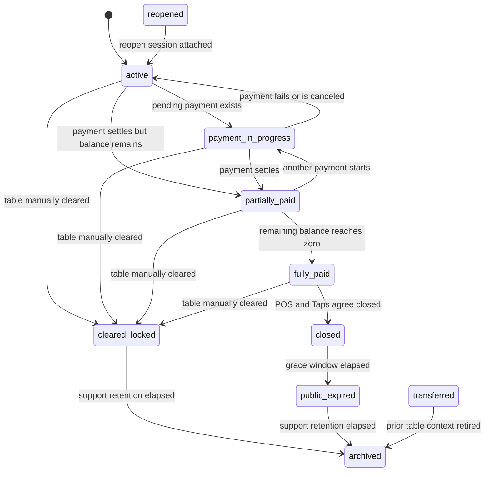
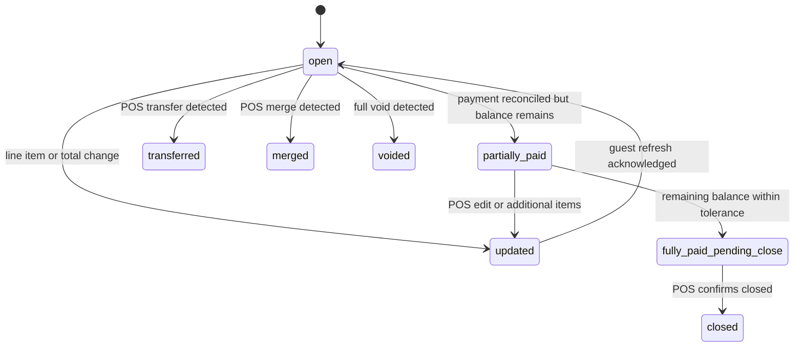
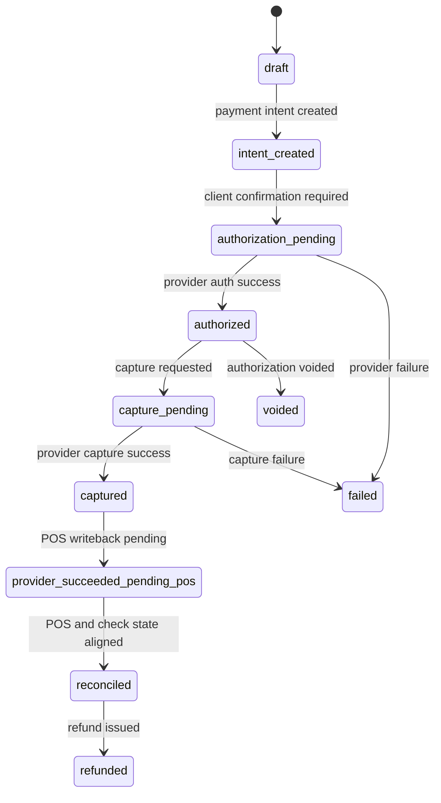

# Taps Domain Model

## Core Entities

## Restaurant

- `id`
- `name`
- `timezone`
- `status`
- `posProvider`
- `paymentProvider`
- `loyaltyMode`
- `publicSessionGraceMinutes`
- `supportRetentionDays`
- `configurationVersion`

## PhysicalTable

- `id`
- `restaurantId`
- `tableCode`
- `displayName`
- `serviceArea`
- `status`
- `activeSessionId`

## NfcTag

- `id`
- `restaurantId`
- `tableId`
- `tagCode`
- `status`
- `lastTappedAt`

## DiningSession

- `id`
- `restaurantId`
- `tableId`
- `nfcTagId`
- `publicToken`
- `status`
- `openedAt`
- `closedAt`
- `publicExpiresAt`
- `auditExpiresAt`
- `archivedAt`
- `reopenedFromSessionId`
- `transferTargetTableId`
- `currentCheckId`
- `sessionVersion`

## CheckSnapshot

- `id`
- `restaurantId`
- `sessionId`
- `posCheckId`
- `sourceSystem`
- `sourceCheckVersion`
- `status`
- `currency`
- `subtotalCents`
- `taxCents`
- `feeCents`
- `discountCents`
- `totalCents`
- `amountPaidCents`
- `remainingBalanceCents`
- `assignmentSummary`
- `version`
- `sourceUpdatedAt`
- `closedAt`

## CheckLineItem

- `id`
- `checkSnapshotId`
- `posLineId`
- `parentLineId`
- `kind`
- `name`
- `quantity`
- `unitPriceCents`
- `extendedPriceCents`
- `status`
- `isStandalone`
- `isModifier`
- `modifierGroup`
- `taxCents`
- `feeCents`
- `grossCents`
- `assignedCents`
- `assignmentStatus`
- `isTinyCharge`
- `metadata`

## Payer

- `id`
- `sessionId`
- `displayName`
- `phoneE164`
- `loyaltyProfileId`
- `status`

## AllocationPlan

- `id`
- `sessionId`
- `checkSnapshotId`
- `checkVersion`
- `status`
- `strategy`
- `allocationHash`
- `version`
- `createdByPayerId`
- `createdAt`

## AllocationEntry

- `id`
- `allocationPlanId`
- `payerId`
- `targetType`
- `targetId`
- `shareBasisPoints`
- `assignedCents`
- `notes`

## PaymentAttempt

- `id`
- `sessionId`
- `checkSnapshotId`
- `checkVersion`
- `payerId`
- `allocationPlanId`
- `status`
- `amountCents`
- `tipCents`
- `authorizedAt`
- `capturedAt`
- `failedAt`
- `provider`
- `providerPaymentIntentId`
- `clientSecret`
- `providerChargeId`
- `posAttachmentStatus`
- `idempotencyKey`
- `errorCode`
- `errorMessage`
- `loyaltyAwardedAt`
- `loyaltyPointsAwarded`

## LoyaltyProfile

- `id`
- `restaurantId`
- `phoneE164`
- `externalCustomerId`
- `status`
- `pointsBalance`

## ReconciliationException

- `id`
- `restaurantId`
- `sessionId`
- `checkSnapshotId`
- `paymentAttemptId`
- `type`
- `severity`
- `status`
- `summary`
- `details`
- `detectedAt`
- `resolvedAt`

## AuditEvent

- `id`
- `restaurantId`
- `sessionId`
- `actorType`
- `actorId`
- `action`
- `subjectType`
- `subjectId`
- `idempotencyKey`
- `payload`
- `createdAt`

## Enums

### SessionStatus

- `active`
- `payment_in_progress`
- `partially_paid`
- `fully_paid`
- `closed`
- `cleared_locked`
- `public_expired`
- `archived`
- `transferred`
- `reopened`

### CheckStatus

- `open`
- `updated`
- `partially_paid`
- `fully_paid_pending_close`
- `closed`
- `voided`
- `transferred`
- `merged`

### CheckLineStatus

- `open`
- `sent`
- `voided`
- `cancelled`
- `transferred`
- `paid`

### PaymentAttemptStatus

- `draft`
- `intent_created`
- `authorization_pending`
- `authorized`
- `capture_pending`
- `captured`
- `provider_succeeded_pending_pos`
- `reconciled`
- `failed`
- `voided`
- `refunded`

### PosAttachmentStatus

- `not_required`
- `pending`
- `attached`
- `failed`

### AllocationPlanStatus

- `draft`
- `proposed`
- `locked_for_payment`
- `partially_funded`
- `completed`
- `invalidated`

### ExceptionStatus

- `open`
- `investigating`
- `resolved`
- `ignored`

## Value Objects

### Money

- `amountCents`
- `currency`

Rules:

- all math is done in integer cents
- only formatting logic converts to decimal display

### PhoneNumber

- stored normalized to E.164
- original raw input retained only where needed for audit/debug

### VersionToken

- integer version for optimistic concurrency
- may be paired with a content hash for allocation validation

## Event Model

### Session events

- `session.created`
- `session.attached_to_table`
- `session.closed`
- `session.public_expired`
- `session.archived`
- `session.transferred`
- `session.reopened`

### Check events

- `check.snapshot_refreshed`
- `check.changed_detected`
- `check.void_synced`
- `check.closed_detected`
- `check.transfer_detected`

### Allocation events

- `allocation.proposed`
- `allocation.locked`
- `allocation.invalidated`
- `allocation.completed`

### Payment events

- `payment.intent_created`
- `payment.authorized`
- `payment.capture_succeeded`
- `payment.capture_failed`
- `payment.pos_attach_pending`
- `payment.reconciled`
- `payment.refunded`

### Loyalty events

- `loyalty.attached_to_session`
- `loyalty.points_awarded`
- `loyalty.reward_redeemed`

### Exception events

- `reconciliation.exception_opened`
- `reconciliation.exception_resolved`

## Idempotency Strategy

### Principles

- every external financial write uses an idempotency key
- webhook ingestion stores provider event IDs and ignores duplicates
- retries reuse the same idempotency key until terminal state
- idempotency keys are recorded in `AuditEvent` and `PaymentAttempt`

### Key formats

- payment intent: `payint:{sessionId}:{payerId}:{checkVersion}:{allocationHash}:{amount}`
- payment capture: `paycap:{paymentAttemptId}`
- POS payment attach: `posattach:{provider}:{paymentAttemptId}`
- loyalty award: `loyalty:{paymentAttemptId}`
- session create from tag tap: `sess:{tagId}:{timeBucket}`

## Versioning Strategy

- `DiningSession.sessionVersion` increments on major lifecycle changes
- `CheckSnapshot.version` increments whenever POS-derived financial or line-item state changes
- `AllocationPlan.version` increments whenever split assignments change
- `AllocationPlan.checkVersion` pins each plan to the bill version it was computed from
- newer check snapshots preserve stable line IDs for unchanged POS lines so the latest session plan can still drive assignment visibility after payment-driven bill refreshes
- client requests that mutate or pay must send the last-seen `checkVersion`
- stale versions produce `409 Conflict` and a fresh snapshot payload

## Concurrency Handling

- optimistic locking in database rows
- Redis lock on `sessionId + checkVersion + allocationHash` during payment initiation
- no payment allowed against invalidated allocation plan
- if check changes during payment authorization, payment may finish provider-side but remain unreconciled until validation completes

## Audit Model

Every material transition records:

- actor type: `guest`, `restaurant_admin`, `system`, `provider_webhook`, `support`
- actor ID or provider reference
- action
- subject type and ID
- correlation ID
- idempotency key
- before/after summary or payload fragment

## State Machines

## Dining Session State Machine

### Rules

- `payment_in_progress` means at least one live payment attempt exists.
- `partially_paid` means committed payments exist but balance remains.
- `fully_paid` means Taps believes balance is zero, but closure is not complete until close validation passes and the session is closed.
- `cleared_locked` immediately blocks public guest access on table turnover while preserving support retention.
- `closed` still allows public receipt/support grace.
- `public_expired` blocks guest access but preserves support review.

## Check State Machine

### Rules

- `updated` forces guest refresh before payment.
- `fully_paid_pending_close` is not equivalent to session complete.

## Payment Attempt State Machine

### Rules

- `provider_succeeded_pending_pos` must be visible to guest and ops.
- `reconciled` is the only successful terminal state for close accounting.

## Close Validation Rules

Table may close only when all are true:

1. remaining balance is zero or within configured 1-cent tolerance
2. no orphaned line items or modifiers remain unassigned
3. no payment attempt is in pending states
4. no open reconciliation exception blocks close
5. POS and Taps both report paid/closed agreement

## Allocation Rules

1. Modifiers inherit parent payer unless explicitly reassigned.
2. Standalone low-cost items must be explicitly allocated or remain in visible remainder.
3. Shared item fractions must sum to exactly 10000 basis points.
4. Rounding distributes pennies deterministically by largest remainder then stable line order.
5. Hybrid allocations cannot exceed remaining amount.

## TODOs

- finalize fee/tax apportionment policy per restaurant and provider capability
- confirm whether gratuity can be apportioned pre- or post-tax by restaurant configuration

## Current Implementation Notes

- The local demo path persists the critical session/check/payment/loyalty state in Postgres when `DATA_STORE_DRIVER=postgres`.
- Background jobs can run through the in-memory queue for local demos or the BullMQ-ready queue driver for Redis-backed environments.
- The Square sandbox-prep adapter currently assumes zero-tip external payment writeback until tip-to-service-charge mapping is finalized with a merchant sandbox account.
